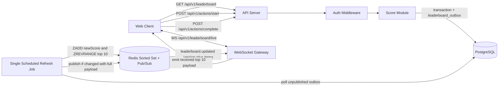
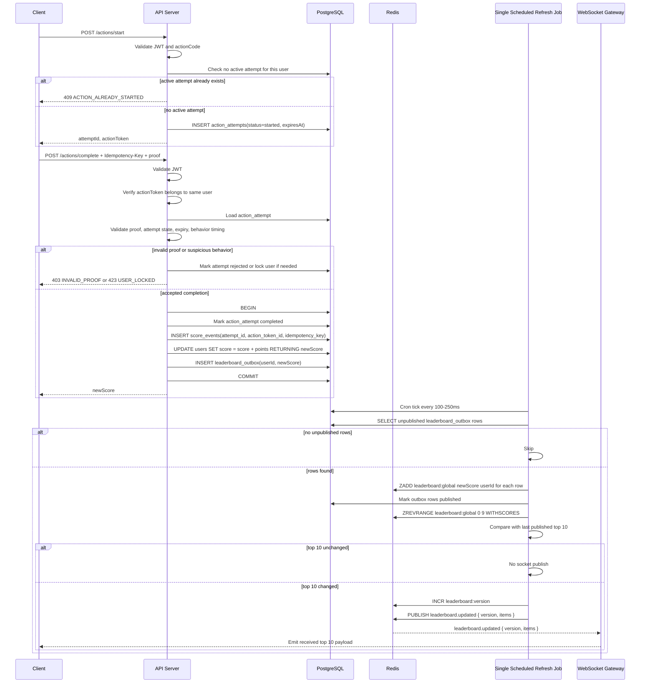

# Problem 6: Live Scoreboard Module

## Goal

Build a backend module for a website scoreboard.

The module must:

- show the top 10 users by score;
- update the scoreboard live;
- increase a user's score after the user completes an action;
- expose an API call for action completion;
- prevent malicious users from increasing scores without authorization.

This document is written as a specification for a backend engineering team to implement.

## Key Decision

The client must never send `score` or `scoreDelta`.

The client only submits a server-issued `actionToken` and completion proof. The backend verifies the token, checks the action attempt state, rejects impossible behavior, calculates points on the server, stores the score event, updates the user's total score, and writes a `leaderboard_outbox` row in the same database transaction. A single scheduled job drains that outbox, updates Redis, and broadcasts only when the top 10 actually changes.

## Architecture

Diagram source: [diagrams/architecture.mmd](./diagrams/architecture.mmd)



## Components

| Component | Responsibility |
| --- | --- |
| Auth Middleware | Verify JWT and attach `userId` to request context |
| Score Module | Validate action attempts, action tokens, completion proof, behavior checks, and score updates |
| Single Scheduled Refresh Job | Drain leaderboard outbox, update Redis, publish full payload only if changed |
| PostgreSQL | Source of truth for users, score totals, score events, and leaderboard outbox |
| Redis Sorted Set | Fast top-10 leaderboard reads |
| Redis Pub/Sub | Broadcast leaderboard changes across API/WS instances |
| WebSocket Gateway | Send initial leaderboard snapshot and live updates |

## Data Model

### `users`

```sql
CREATE TABLE users (
  id UUID PRIMARY KEY,
  display_name VARCHAR(100) NOT NULL,
  score BIGINT NOT NULL DEFAULT 0,
  created_at TIMESTAMP NOT NULL DEFAULT NOW(),
  updated_at TIMESTAMP NOT NULL DEFAULT NOW()
);

CREATE INDEX idx_users_score_rank
  ON users(score DESC, id ASC);
```

### `action_types`

Defines actions and how many points each action awards. Points are controlled by the backend, not by the client.

```sql
CREATE TABLE action_types (
  code VARCHAR(80) PRIMARY KEY,
  points INT NOT NULL CHECK (points > 0),
  min_duration_ms INT NOT NULL DEFAULT 0,
  is_active BOOLEAN NOT NULL DEFAULT true,
  created_at TIMESTAMP NOT NULL DEFAULT NOW()
);
```

`min_duration_ms` is optional anti-abuse metadata. For example, if an action cannot realistically finish in less than 2 seconds, the complete API rejects attempts completed faster than that.

### `action_attempts`

Tracks one server-issued attempt. This prevents a user from simply scripting `start -> complete` without a valid attempt state.

```sql
CREATE TABLE action_attempts (
  id UUID PRIMARY KEY,
  user_id UUID NOT NULL REFERENCES users(id),
  action_code VARCHAR(80) NOT NULL REFERENCES action_types(code),
  action_token_id UUID NOT NULL UNIQUE,
  status VARCHAR(20) NOT NULL CHECK (status IN ('started', 'completed', 'expired', 'rejected')),
  proof_hash VARCHAR(128),
  suspicious_reason TEXT,
  expires_at TIMESTAMP NOT NULL,
  created_at TIMESTAMP NOT NULL DEFAULT NOW(),
  completed_at TIMESTAMP NULL
);

CREATE INDEX idx_action_attempts_user_status
  ON action_attempts(user_id, status, created_at DESC);

CREATE UNIQUE INDEX uq_action_attempts_one_open_per_user
  ON action_attempts(user_id)
  WHERE status = 'started';
```

The module does not need to know the internal game/action mechanic. It only requires a `validateCompletionProof` hook that can confirm the attempt was completed according to the product rule.

The unique partial index makes sure one user can only have one open action attempt at a time. This prevents a client from starting many parallel sessions and completing whichever one is easiest to exploit.

### `user_security_locks`

Temporarily blocks users with repeated suspicious attempts.

```sql
CREATE TABLE user_security_locks (
  user_id UUID PRIMARY KEY REFERENCES users(id),
  reason TEXT NOT NULL,
  locked_until TIMESTAMP NOT NULL,
  created_at TIMESTAMP NOT NULL DEFAULT NOW()
);
```

Examples: too many invalid proofs, repeated replay attempts, or actions completed faster than the configured minimum duration.

### `score_events`

Immutable audit log for accepted score changes.

```sql
CREATE TABLE score_events (
  id UUID PRIMARY KEY,
  user_id UUID NOT NULL REFERENCES users(id),
  action_code VARCHAR(80) NOT NULL REFERENCES action_types(code),
  action_attempt_id UUID NOT NULL REFERENCES action_attempts(id),
  action_token_id UUID NOT NULL,
  idempotency_key VARCHAR(120) NOT NULL,
  points INT NOT NULL CHECK (points > 0),
  created_at TIMESTAMP NOT NULL DEFAULT NOW(),
  UNIQUE(action_token_id),
  UNIQUE(user_id, idempotency_key)
);

CREATE INDEX idx_score_events_user_created_at
  ON score_events(user_id, created_at DESC);
```

### `leaderboard_outbox`

Database-backed queue for updating Redis after a score transaction commits.

```sql
CREATE TABLE leaderboard_outbox (
  id UUID PRIMARY KEY,
  user_id UUID NOT NULL REFERENCES users(id),
  new_score BIGINT NOT NULL,
  created_at TIMESTAMP NOT NULL DEFAULT NOW(),
  published_at TIMESTAMP NULL
);

CREATE INDEX idx_leaderboard_outbox_unpublished
  ON leaderboard_outbox(created_at)
  WHERE published_at IS NULL;
```

The outbox row is written in the same transaction as `score_events` and `users.score`. If Redis is down, the row stays unpublished and the scheduled job retries later.

## Redis Keys

| Key | Type | Purpose |
| --- | --- | --- |
| `leaderboard:global` | Sorted Set | member = `userId`, score = total score |
| `leaderboard:version` | Counter | monotonic version for live updates |
| `leaderboard:updates` | Pub/Sub | fan-out channel for WebSocket instances |
| `action-token:{tokenId}` | String | optional replay guard if action tokens are stored server-side |
| `rate-limit:{userId}:complete` | Counter | abuse prevention |

PostgreSQL remains the source of truth. Redis can be rebuilt from PostgreSQL.

## API Specification

All protected endpoints require:

```http
Authorization: Bearer <jwt>
```

### 1. Start Action

`POST /api/v1/actions/start`

Creates a short-lived token for one action attempt. This is the recommended way to prevent clients from inventing valid completion requests.

If the action system already exists in another service, this endpoint can be replaced by that service issuing the same kind of signed one-time token.

A user can only have one active attempt at a time. If the user already has a `started` attempt, the API should return that attempt or reject with `409 ACTION_ALREADY_STARTED`; it must not create a second parallel session.

The database unique index is still required because two start requests can arrive at the same time.

Request:

```json
{
  "actionCode": "daily-check-in"
}
```

Response `201 Created`:

```json
{
  "success": true,
  "data": {
    "attemptId": "uuid",
    "actionToken": "signed-one-time-token",
    "expiresIn": 300
  }
}
```

Token claims:

```json
{
  "jti": "token-uuid",
  "sub": "user-id",
  "attemptId": "attempt-uuid",
  "actionCode": "daily-check-in",
  "exp": 1770000000
}
```

### 2. Complete Action

`POST /api/v1/actions/complete`

Request headers:

```http
Authorization: Bearer <jwt>
Idempotency-Key: <uuid>
Content-Type: application/json
```

Request body:

```json
{
  "actionToken": "signed-one-time-token",
  "completionProof": "server-verifiable-proof"
}
```

Response `200 OK`:

```json
{
  "success": true,
  "data": {
    "userId": "uuid",
    "awardedPoints": 10,
    "newScore": 120,
    "rank": 8,
    "leaderboardVersion": 42
  }
}
```

Rules:

- JWT `sub` must match the `sub` inside `actionToken`.
- `actionToken` must be valid, unexpired, and unused.
- `attemptId` inside the token must exist, belong to the same user, and still be `started`.
- `actionCode` must exist and be active.
- completion proof or server-side attempt state must be valid.
- impossible behavior, such as completing faster than `action_types.min_duration_ms`, must be rejected and can lock the attempt or user.
- awarded points must be read from `action_types.points`.
- duplicate `Idempotency-Key` returns the original result or `409`, but must not award points twice.

### 3. Get Leaderboard

`GET /api/v1/leaderboard?limit=10`

Response `200 OK`:

```json
{
  "success": true,
  "data": {
    "version": 42,
    "generatedAt": "2026-05-07T00:00:00.000Z",
    "items": [
      {
        "rank": 1,
        "userId": "uuid",
        "displayName": "Alice",
        "score": 900
      }
    ]
  }
}
```

Notes:

- default `limit` is `10`;
- maximum `limit` is `10` for this requirement;
- sort by `score DESC`, then `userId ASC` for deterministic ties.

### 4. Live Leaderboard

`WS /api/v1/leaderboard/live`

On connect, the server sends the current top 10 snapshot.

Server event:

```json
{
  "type": "leaderboard.updated",
  "version": 43,
  "items": [
    {
      "rank": 1,
      "userId": "uuid",
      "displayName": "Alice",
      "score": 910
    }
  ]
}
```

Client behavior:

- ignore events with `version` lower than or equal to the last seen version;
- reconnect with backoff if the socket disconnects;
- call `GET /api/v1/leaderboard` after reconnect to resync.

## Score Update Flow

Diagram source: [diagrams/score-update-flow.mmd](./diagrams/score-update-flow.mmd)



## Transaction Rules

`POST /actions/complete` must be atomic:

1. Verify JWT and action token.
2. Load `action_attempts` by `attemptId`.
3. Reject if the attempt is not owned by the user, not `started`, expired, already completed, or behavior is impossible.
4. Validate completion proof or server-side attempt state.
5. Start DB transaction.
6. Mark `action_attempts.status = completed`.
7. Insert `score_events`.
8. If `action_token_id` already exists, stop and do not update score.
9. Update `users.score = users.score + action_types.points` and return `newScore`.
10. Insert `leaderboard_outbox(user_id, new_score)`.
11. Commit.
12. A single scheduled job polls unpublished outbox rows every 100-250 ms.
13. The job writes Redis with absolute `newScore` using `ZADD`.
14. The job marks outbox rows as published after Redis succeeds.
15. The job reads top 10 and publishes `leaderboard.updated` with full `{ version, items }` only if the top 10 changed.

If Redis fails after DB commit, do not roll back the score. The outbox row remains unpublished, so the scheduled job can retry until Redis succeeds.

## Security

- Do not accept score values from the client.
- Require JWT on action start and action completion.
- Bind `actionToken.sub` to the authenticated `userId`.
- Allow only one `started` action attempt per user at a time.
- Use short token TTL, for example 5 minutes.
- Validate the `action_attempts` row before awarding points.
- Reject impossible timing or invalid action progress, for example completing an action faster than `min_duration_ms`.
- Lock or temporarily block users with repeated invalid proof, replay, or impossible timing attempts.
- Store or uniquely log `action_token_id` to prevent replay.
- Require `Idempotency-Key` for retry safety.
- Rate limit action completion by user and IP.
- Keep `score_events` immutable for audit.
- WebSocket is read-only; it must never accept score-changing messages.
- Log rejected completion attempts with `userId`, `actionCode`, reason, and request id.

## Error Cases

| Status | Code | Reason |
| --- | --- | --- |
| 400 | `VALIDATION_ERROR` | invalid body or missing idempotency key |
| 401 | `UNAUTHORIZED` | missing or invalid JWT |
| 403 | `FORBIDDEN` | action token belongs to another user |
| 403 | `INVALID_PROOF` | completion proof or server-side attempt state is invalid |
| 404 | `ACTION_NOT_FOUND` | action code does not exist or is inactive |
| 409 | `ACTION_ALREADY_STARTED` | user already has an active action attempt |
| 409 | `DUPLICATE_ACTION` | action token or idempotency key was already used |
| 410 | `ACTION_TOKEN_EXPIRED` | action token is expired |
| 423 | `USER_LOCKED` | user is temporarily locked after suspicious behavior |
| 429 | `RATE_LIMITED` | too many completion attempts |

## Performance Targets

| Metric | Target |
| --- | --- |
| `GET /leaderboard` p95 | under 100 ms |
| `POST /actions/complete` p95 | under 250 ms |
| Live update delay p95 | under 1 second |
| Leaderboard size | top 10 only |

Implementation notes:

- Use Redis `ZREVRANGE leaderboard:global 0 9 WITHSCORES` for fast top 10 reads.
- Use `ZADD leaderboard:global newScore userId`, not `ZINCRBY points userId`. Setting the absolute score is retry-safe; applying the delta twice would double-credit the user.
- Mark outbox rows as published only after Redis `ZADD` succeeds. If the job crashes before that, retrying the same `ZADD newScore` is safe.
- Do not broadcast on every score update. Drain outbox rows in batches, compare old/new top 10, and publish only when the top 10 changed.
- Run one scheduled job, for example every 100-250 ms. This is enough for the global top-10 board and avoids duplicate publishes.
- Publish the full `{ version, items }` payload. WebSocket gateways should emit that payload directly instead of querying Redis again.
- Rebuild Redis from PostgreSQL on startup if the sorted set is empty.

## Testing Checklist

- valid user can start and complete an action;
- user cannot start a second action while another attempt is still `started`;
- completing an action increases score by server-side configured points;
- client-provided score is ignored or rejected;
- token for user A cannot update user B's score;
- same action token cannot be used twice;
- same idempotency key cannot award points twice;
- completion without valid proof is rejected;
- impossible timing marks the attempt rejected and can lock the user;
- leaderboard returns exactly top 10 sorted users;
- tie ranking is deterministic;
- WebSocket receives initial snapshot;
- WebSocket receives update after score change;
- Redis outage leaves outbox rows unpublished and does not lose committed score updates;
- Redis rebuild restores leaderboard from PostgreSQL.

## Future Improvements

- Add fraud scoring for suspicious action patterns.
- Add admin tools to disable actions or reverse fraudulent score events.
- Add per-action daily limits if product rules require them.
- Add score earning caps per user, for example maximum points per hour and per day, to limit damage from compromised accounts or automation.
- Add regional or friends-only leaderboards using separate Redis sorted sets.
- Move outbox processing to a dedicated queue such as Kafka if write throughput grows beyond what DB polling can handle.
